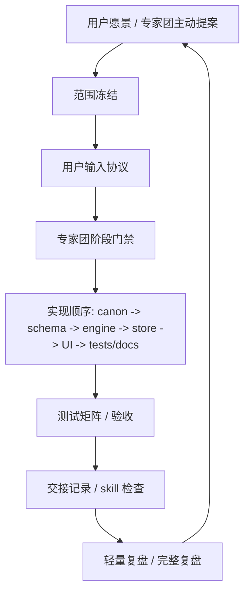

# v0.11.0-process-1 开发流程进化专项

日期：2026-05-15
状态：第一版已建立。
性质：治理/流程专项，不改运行时代码。

## 为什么现在做

RebornG 正在从“功能推进”进入“活世界长期工程”。后续会同时出现：

- 玩家自由意图。
- 活世界状态。
- 原著事实卡。
- DeepSeek 叙事回流。
- NPC/势力记忆。
- IF 偏离与正史边界。
- UI 可读性、测试矩阵、旧档迁移。

如果开发流程继续依赖用户临时提醒，项目会在复杂度上升后失控。
本专项把开发流程变成强力工具：让用户输入、专家团审查、测试门禁、复盘和外部模式借鉴全部制度化。

## 本专项目标

1. 明确用户什么时候需要输入，以及输入什么。
2. 明确哪些事情 Codex 可以自动推进，哪些必须停下来让用户决策。
3. 固化专家团阶段门禁，避免开发时只按功能冲刺。
4. 建立 ADR-lite、复盘、bug 学习和用户决策模板。
5. 把 GitHub/DORA/SRE/SDL/Voyager/Generative Agents/Reflexion 等外部思想转成 RebornG 可执行规则。
6. 更新项目入口与 skill，让这个流程在后续阶段自动被读取。
7. 建立项目仪表盘和 Git 提交/推送制度，让进度与提交节奏不再依赖口头约定。

## 非目标

- 不引入 Jira、Linear 或复杂项目管理工具。
- 不创建 `.codex/agents/*.toml`。
- 不启用可写多子代理。
- 不改变运行时代码。
- 不新增玩法、UI、存档字段或 DeepSeek 策略。
- 不把每个小决定都写成 ADR。

## 流程总览

## 用户输入制度

用户不是日常任务拆解员，而是“方向、边界、口感、取舍”的最终裁判。

用户输入分为 6 类：

| 类型 | 触发时机 | 用户需要给什么 |
|---|---|---|
| 方向输入 | 版本开始、重大专项开始 | 本阶段玩家应该感受到什么 |
| 边界输入 | 世界观/IF/奖励/自由度有风险时 | 哪些事实不能乱、哪些自由度允许尝试 |
| 优先级输入 | 专家团给 3-5 个候选需求时 | 批准、驳回、延期、合并、排序 |
| 口感输入 | 可玩样板或 UI 样板出现后 | 像不像蛊真人、爽不爽、自由不自由 |
| 取舍输入 | 质量/速度/范围/稳定性冲突时 | 牺牲哪一项、保哪一项 |
| 发布输入 | 对外材料、公告、截图、承诺前 | 哪些可以公开，哪些不能承诺 |

详细规则见 `v0.11.0-process-1-用户输入协议.md`。

## Codex 自动推进边界

Codex 可以自动推进：

- 已批准范围内的代码实现。
- 已批准范围内的测试、文档、交接更新。
- 小型 bug 修复和对应回归测试。
- 文档事实同步。
- 专家团候选需求整理。
- 不改变用户承诺的局部重构。
- 更新项目仪表盘中的阶段、阻塞、测试和 Git 状态。

Codex 必须停下来问用户：

- 新增或改变版本目标。
- 改变原著/IF 边界。
- 放开新的自由度入口。
- 新增持久化字段或提升 `SAVE_FORMAT_VERSION`。
- 让 DeepSeek 获得新的写入权。
- 引入外部运行时依赖。
- 启用可写子代理或复杂多代理流程。
- 对外发布、截图、公告、宣传承诺。

## 专家团阶段门禁

每个阶段必须回答：

1. 当前改动触发哪些专家角色？
2. 是否触碰活世界、自由意图、DeepSeek、原著/IF、存档、UI 可读性或测试矩阵？
3. 是否需要用户输入？属于方向、边界、优先级、口感、取舍还是发布？
4. 是否需要 ADR-lite？
5. 是否需要更新 `.learnings/ERRORS.md` 或 `.learnings/LEARNINGS.md`？
6. 是否需要更新 skill、`PROJECT-STATE.md` 或上下文交接？
7. 是否需要更新 `v0.11.0-项目仪表盘.md` 和 Git 提交/推送状态？

详细门禁见 `v0.11.0-process-1-专家团阶段门禁.md`。

## 外部模式吸收原则

外部模式只吸收思想，不直接套组织外壳。

| 外部来源 | 吸收思想 | RebornG 落地 |
|---|---|---|
| GitHub Flow / Actions | 小批量、PR 模板、CI 门禁 | 后续建立 GitHub workflow 与 checklist |
| DORA / Continuous Delivery | 高频小步、自动验证 | 小版本验收和固定测试命令 |
| Google SRE | 无责复盘、事故记录 | bug -> ERRORS -> 回归测试 |
| Microsoft SDL | 威胁建模 | AI 越权、隐藏事实泄露、存档污染门禁 |
| Voyager | 技能库、自我课程、自我验证 | skill 进化、候选需求池、测试矩阵增长 |
| Generative Agents | 观察、记忆、反思、计划 | NPC/势力记忆的结构化设计参考 |
| Reflexion | 失败经验反哺 | `.learnings` 与复盘模板 |
| Agent-as-a-Judge | agent 审查 agent | 后续只读审查代理试点 |

详细映射见 `v0.11.0-process-1-外部模式借鉴映射.md`。

## 完成定义

本专项完成时必须具备：

- 用户输入协议已建立。
- 专家团阶段门禁已建立。
- ADR-lite、复盘、bug 学习、用户决策模板已建立。
- 外部模式借鉴映射已建立。
- `v0.11.0-项目仪表盘.md` 已建立，并纳入阶段完成门禁。
- `v0.11.0-Git提交与推送制度.md` 已建立，并纳入交接记录。
- `README.md`、路线图、真相源索引、需求决策池、`PROJECT-STATE.md`、`AGENTS.md`、专家团 skill 已同步。
- 后续进入 `v0.11.0-a3-2` 前，能够明确判断是否需要用户输入。
