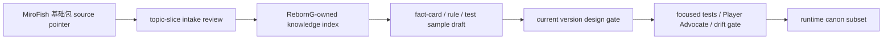

# v1.6.0-a1 内容知识库 canon schema 设计门禁

状态：completed；D-161 已批准
日期：2026-05-21
性质：文档/架构门禁；不改 runtime、不新增脚本、不 bump save、不扩 DeepSeek 权限

## 0. 前置批准

用户已批准 D-160-001 至 D-160-012：

- v1.6 主线定为 `内容生产、canon schema 与长测工厂`。
- 先做 a0/a1/a2 设计门禁，再做工具脚本。
- 默认不改 runtime、不 bump save、不扩 DeepSeek 权限。
- MiroFish 基础包继续只作为 archive/source-pointer inventory。
- 允许后续设计基础包 inventory、知识索引边界、intake 晋升链、长测工厂和 stale-entrypoint report-only 检查。
- 禁止删除历史证据文档；默认只做标历史、压入口、加替代指针。
- live DeepSeek drift probe 仍需单独批准模型、成本、样本、轮次。
- 任意 runtime canon 晋升、DeepSeek 可见摘要、hidden/private 可见化必须再次停下来由用户决策。

## 1. 本门禁要回答什么

v1.6 的核心风险不是“有没有资料”，而是资料层级被混用：

1. MiroFish 基础包是不是被误当成知识库或 canon。
2. 知识索引条目是否有足够字段支持审计。
3. fact-card / rule / test sample / runtime canon 是否有清晰晋升链。
4. hidden/private、高阶原著事实、方源私密因果是否被误放进玩家可见或 DeepSeek visible context。
5. 后续工具脚本应该先 report-only，还是直接成为 CI 硬门。

门禁结论先给出：专家团建议 **a1 只定义 schema 与晋升规则，不实现脚本，不吸收基础包内容，不生成 runtime canon**。a2 再进入 MiroFish 基础包 inventory 设计门禁。

## 2. 三类核心对象

| 对象 | 目录 | 权威状态 | a1 结论 |
|---|---|---|---|
| MiroFish 基础包 | `指导大纲/vMiroFish/基础包/` | archive/source-pointer inventory | 只能被 topic-slice intake 读取，不能整包吸收 |
| 知识索引条目 | `指导大纲/知识库/蛊真人/` | 项目索引，非 runtime | 必须有 visibility、promotionStatus、allowedUses、forbiddenUses |
| runtime canon | `src/canon/*.json` | 运行时真相源 | 只能由当前版本门禁 + 测试 + 用户决策晋升 |

## 3. 知识索引条目最小 schema

知识索引条目可以是 JSON 或 Markdown 表格，但必须表达同等字段：

```json
{
  "id": "kb_ri_low_rank_route_pressure_001",
  "kind": "person | faction | place | event | gu | material | timeline | hidden_fact | if_boundary | rule_sample | test_sample",
  "summary": "RebornG-owned summary, no original prose",
  "sourcePointers": ["ri_lw_ch_0001:event:example"],
  "visibility": "public | player_visible | hidden_ref_only | private | deferred",
  "promotionStatus": "raw_candidate | intake_accepted | fact_card_draft | rule_draft | test_sample | runtime_promoted | deferred | quarantined | rejected",
  "allowedUses": ["design_review", "knowledge_index", "test_matrix"],
  "forbiddenUses": ["deepseek_visible_context", "player_visible_hidden_body", "runtime_authority"],
  "mirofishRefs": ["base:ri_lw_ch_0001"],
  "intakeReviewRefs": ["指导大纲/vMiroFish/intake-reviews/..."],
  "testSampleRefs": ["V16-A1-SCHEMA-001"],
  "lastReviewedVersion": "v1.6.0",
  "reviewNotes": "why this entry is safe or deferred"
}
```

## 4. promotionStatus 语义

| 状态 | 含义 | 能否进入 runtime |
|---|---|---|
| `raw_candidate` | 未经 intake 的候选材料 | 否 |
| `intake_accepted` | 通过 intake，可作为候选池 | 否 |
| `fact_card_draft` | 可转写为事实卡草案 | 否 |
| `rule_draft` | 可转写为规则草案 | 否 |
| `test_sample` | 可进入测试矩阵或漂移样本 | 否 |
| `runtime_promoted` | 已通过当前版本门禁、测试和用户授权 | 是，仅限明确子集 |
| `deferred` | 延后处理 | 否 |
| `quarantined` | 隔离，通常涉及 hidden/private 或质量风险 | 否 |
| `rejected` | 拒绝使用 | 否 |

## 5. visibility 语义

| 可见性 | 说明 | DeepSeek visible | UI visible |
|---|---|---|---|
| `public` | 原著/世界公开安全信息，仍需 RebornG 改写 | 需另批 | 需当前版本门禁 |
| `player_visible` | 当前玩家状态下可见的安全摘要 | 需当前 context gate | 可以 |
| `hidden_ref_only` | 只允许保留 ref，不允许暴露正文 | 否 | 否 |
| `private` | 私密/高风险/后期真相 | 否 | 否 |
| `deferred` | 未判定 | 否 | 否 |

## 6. allowedUses / forbiddenUses

`allowedUses` 只能描述当前阶段允许的低权限用途，例如：

- `design_review`
- `knowledge_index`
- `test_matrix`
- `drift_sample`
- `fact_card_draft`
- `rule_draft`
- `coverage_report`

`forbiddenUses` 必须显式列出高风险禁用项，例如：

- `deepseek_visible_context`
- `player_visible_hidden_body`
- `runtime_authority`
- `canon_promotion`
- `formal_location`
- `formal_faction`
- `formal_reward`
- `npc_life_death`
- `public_release_wording`

## 7. canon 草案 schema

runtime canon 不能直接从知识索引复制。canon 草案必须先存在为 draft：

```json
{
  "id": "canon_draft_low_rank_route_pressure_001",
  "sourceKnowledgeIds": ["kb_ri_low_rank_route_pressure_001"],
  "draftKind": "fact_card | rule | anchor | boundary | sample",
  "runtimeTarget": "none | src/canon/qingmao-xxx.json",
  "summary": "RebornG-owned runtime-safe draft",
  "authorityOwner": "local_engine | canon_data | test_only",
  "requiresUserDecision": true,
  "requiredTests": ["focused_unit", "e2e", "player_advocate", "drift_gate"],
  "forbiddenWrites": ["reward", "location", "faction", "npc_life_death", "deepseek_authority"],
  "promotionStatus": "draft_only"
}
```

a1 结论：v1.6-a1 不生成 canon 草案文件，只冻结 schema。

## 8. 测试样本 schema

长测/漂移/Player Advocate/DeepSeek eval 样本需要统一字段：

```json
{
  "id": "V16-A1-HIDDEN-001",
  "sourceKnowledgeIds": ["kb_hidden_example"],
  "sampleType": "unit | e2e | player_advocate | drift | deepseek_eval | stale_entrypoint",
  "playerIntent": "what the player tries",
  "worldStateSetup": "minimal state / refs",
  "expectedBoundary": "what must not drift or leak",
  "acceptance": "pass/fail rule",
  "matrixStatus": "current_matrix | future_sample_pool | discarded",
  "lastReviewedVersion": "v1.6.0"
}
```

新样本必须进入测试矩阵演进流程；不能只写在会议纪要里。

## 9. 晋升链



任一节点缺失时，后续工具只能 report failure，不能自动晋升。

## 10. 后续工具的 a1 边界

| 工具候选 | a1 结论 | 初始模式 |
|---|---|---|
| `check:knowledge-index-boundaries` | 可在 b1 实现 | report-only |
| `check:mirofish-intake-promotions` | 可在 b2 实现 | report-only |
| `check:mirofish-base-pack-inventory` | a2 先设计 | report-only |
| long-test replay/eval factory | b3 先建骨架 | offline/deterministic |
| stale-entrypoint checker | b4 实现 | report-only |

任何工具进入 CI hard gate，必须另批。

## 11. Skill sync audit

| Skill | 状态 | 理由 |
|---|---|---|
| `reborn-expert-council` | updated | D-160 全批准，当前 active draft 转为 v1.6-a1；D-161 后续已由用户批准 |
| `game-dev-text` | updated | a1 涉及 schema、report-only 工具边界、测试样本、CI hard gate 风险 |
| `reverend-insanity-lore` | updated | a1 锁定 full-book knowledge、hidden/private、canon promotion 和 DeepSeek 可见边界 |
| `mirofish-reborng-export` | updated | a1 明确 MiroFish 基础包、topic-slice、export 和 intake promotion schema |
| `reborn-combat-motion` | no_update_needed | a1 不触发 runtime、战斗表现、动效或视觉资产 |

## 12. 本阶段没有做什么

- 没有 runtime。
- 没有 save-format bump。
- 没有新增 schema/store/engine/UI 文件。
- 没有新增脚本。
- 没有读取或改写 MiroFish 基础包内容。
- 没有知识库批量导入。
- 没有 DeepSeek 权限变化。
- 没有 public wording 或 EdgeOne 部署。

## 13. a1 后必须由用户拍板的 D-161 决策

| ID | 决策项 | 专家团建议 | 影响 |
|---|---|---|---|
| D-161-001 | 是否批准 a1 的知识索引最小 schema | 建议批准 | 作为 b1 checker 的字段基准 |
| D-161-002 | 是否批准 `promotionStatus` 九态定义 | 建议批准 | 防止候选材料绕过 intake 直接 runtime 化 |
| D-161-003 | 是否批准 `visibility` 五态定义 | 建议批准 | 防止 hidden/private 泄漏 |
| D-161-004 | 是否要求每条知识索引必须有 `allowedUses` / `forbiddenUses` | 建议批准 | 让机械检查能识别越权用途 |
| D-161-005 | 是否批准 canon 草案只作为 draft，不在 v1.6-a1 创建 runtime canon 文件 | 建议批准 | 保持 a1 为 schema 门禁 |
| D-161-006 | 是否批准测试样本 schema 并接入测试矩阵演进规则 | 建议批准 | 让 drift/Player Advocate/DeepSeek eval 样本可追踪 |
| D-161-007 | 是否批准晋升链缺失时工具只能 report failure，不能自动补链或晋升 | 建议批准 | 防止工具越权修数据 |
| D-161-008 | 是否批准 b1/b2/b3/b4 工具初始全部 report-only | 建议批准 | 避免工具第一版破坏历史证据或 CI |
| D-161-009 | 是否批准任何 CI hard gate 需要 rc 或单独用户决策 | 建议批准 | 保持开发节奏可控 |
| D-161-010 | 是否批准 a2 先做 MiroFish 基础包 inventory 设计门禁，再实现任何检查脚本 | 建议批准 | 符合 D-160 的先门禁后脚本 |

## 当前结论

用户已批准 D-161-001 至 D-161-010。当前已进入：

`v1.6.0-a2-MiroFish基础包inventory设计门禁.md`
