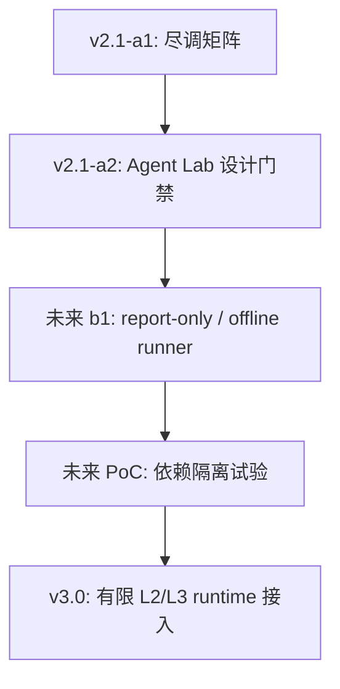

# v2.1.0-a1 Agent 框架吸收矩阵

状态：draft；已按用户要求纳入 a1 尽调范围。
日期：2026-05-22

## 定位

本文件把 `v2.1.0-a1` 从单一 Claude Code 尽调扩展为“Claude Code + 开源 Agent 框架吸收矩阵”。

本批只做资料尽调和 RebornG 架构映射：

- 不新增 runtime agent。
- 不新增 SDK / npm / Python 依赖。
- 不新增后端/BFF。
- 不调用 live DeepSeek。
- 不启用子代理。
- 不新增 save fields，不 bump `SAVE_FORMAT_VERSION`。
- 不新增 DeepSeek prompt/context/model/authority。
- 不新增 MiroFish export。
- 不开放正式地点、阵营、奖励、NPC 生死或 canon promotion。

## 许可与使用原则

公开 GitHub 仓库不等于可自由复制的开源实现。RebornG 对外部 agent 项目采用三档原则：

| 档位 | 允许 | 禁止 |
|---|---|---|
| 架构思想 | 阅读官方文档、公开 README、license，吸收模式和边界 | 直接搬代码、复制私有实现、绕过许可证 |
| 可二次开发开源代码 | 仅在许可证明确允许且后续用户批准依赖/原型后，做隔离 PoC | 现在引入 runtime 依赖或把第三方框架变成世界内核 |
| 源码不可自由使用 | 只参考官方公开概念和产品形态 | 反编译、泄露、未授权源码、许可证不明代码 |

Claude Code 的官方仓库是公开可见，但其 `LICENSE.md` 写明保留权利并受商业条款约束。因此当前只能参考官方架构模式，不可把它当成可复制/可改造的开源基础。

## 优先级总表

| 框架/项目 | 许可证/状态 | 尽调优先级 | RebornG 吸收目标 | 明确不用法 |
|---|---|---:|---|---|
| Claude Code | 官方仓库公开；license 为 all rights reserved / commercial terms | P0 | 工具权限、approval、hooks、session、MCP、subagents 隔离、skill/plugin 路由 | 不复制源码，不用反编译/泄露代码，不把 coding agent 当 NPC agent |
| LangGraph | MIT | P0 | 长运行状态图、durable execution、human-in-loop、memory、可回放 orchestration | 不让图框架接管 WorldCore，不默认接 LangSmith/部署服务 |
| Mastra | 核心 Apache-2.0；`ee/` 等目录为企业许可 | P0 | TS-first workflow/agent/memory/evals/MCP，贴近 RebornG 技术栈 | 不引入 enterprise 目录，不默认把 Mastra 变成后端 |
| OpenAI Agents SDK | MIT；Python 与官方 JS/TS 仓库 | P1 | handoffs、guardrails、tracing、tools、sandbox-agent 概念 | 不切换模型供应商，不引入 sandbox 写文件能力到 RebornG |
| Google ADK | Apache-2.0；Python | P1 | workflow runtime、Task API、human-in-loop、nested workflow、retry/state | 不把 Google ADK 作为 v2.1 runtime 依赖 |
| Microsoft AutoGen | code MIT；docs CC-BY-4.0 | P1 | 多 agent message passing、event-driven local/distributed runtime、AgentChat/Core 分层 | 不把 NPC 社会做成无裁决聊天群 |
| CrewAI | MIT | P2 | Crews/Flows 分离、角色协作 vs 精确流程的边界 | 不把 role-play agent 当世界真实状态 |
| PydanticAI | MIT | P1 | schema、dependency injection、type-safe output、eval/validator 思路 | 不把 Python schema 直接替代 TypeScript/Zod 真相源 |
| Letta | Apache-2.0 | P2 | 长期记忆、stateful agent、memory block 研究 | 不允许记忆自进化污染 canon/save/hidden facts |
| OpenHands | 核心 MIT；enterprise 目录另算 | P2 | agent server、CLI/GUI、agent SDK、权限/RBAC、软件开发 agent sandbox 经验 | 不把软件开发 agent 直接移植成游戏世界 NPC |

## 分层吸收建议

| RebornG 目标 | 优先参考 | 吸收方式 |
|---|---|---|
| Agent Orchestrator | Claude Code、LangGraph、Mastra、Google ADK | 设计可暂停、可审计、可回放的 proposal 调度循环 |
| Permission Matrix | Claude Code、OpenAI Agents SDK、OpenHands | 把 tool permission、approval、RBAC 转为 RebornG agent 能力白名单 |
| Visibility Gate | Claude Code、Letta、PydanticAI | hidden/private/player-visible 分层先于上下文组装 |
| AgentProposal schema | PydanticAI、OpenAI Agents SDK、Mastra | 用 schema/validator/eval 保证 agent 只输出候选，不写事实 |
| WorldCore post-check | LangGraph、Google ADK、AutoGen | 将 graph/workflow 结果送入 WorldCore 最终裁决，不让 agent 自裁决 |
| Eval Farm | LangGraph、Mastra、OpenAI Agents SDK、PydanticAI | tracing、eval、guardrails、replay archive，先 report-only |
| Memory Lab | Letta、Generative Agents、Concordia | 只研究反思/记忆摘要，不让自生成记忆晋升 canon |
| 多 agent 协作 | AutoGen、CrewAI、Google ADK | 研究消息协议、任务委派和角色协作，不采用群聊式世界模拟 |
| Thin BFF 预备 | Mastra、OpenHands、LangGraph deployment 思路 | 只作为 v2.4+ 评估材料，不在 v2.1 实现 |

## RebornG 采用路径

当前只允许走到 `a1 -> a2`。从 `b1` 开始，任何 runner、依赖、SDK、后端、live DeepSeek、子代理、MiroFish export 或 runtime 接入都必须另列决策项。

## 专家团初判

### Project Lead

建议将 a1 正式更名为“Claude Code 与开源 Agent 框架尽调”，避免路线只盯一个非开源产品。a1 的目标不是选型，而是建立“能学什么、不能学什么、未来怎么选”的矩阵。

### Systems Architect

LangGraph 和 Mastra 最值得深挖：前者像长期状态/工作流骨架，后者贴近 TypeScript 栈。两者都不能直接获得 WorldCore 权限。

### AI Pipeline Architect

OpenAI Agents SDK、PydanticAI、Google ADK 的 guardrails / tracing / schema / human-in-loop 值得转译为 eval farm 和 AgentProposal validator。模型供应商和 SDK 依赖不在当前范围。

### Lore Guard

Letta 的长期记忆很诱人，也最危险。RebornG 可以研究记忆块、反思和检索，但记忆不能自己变成原著事实、hidden body、NPC 生死或 canon。

### QA / Eval

AutoGen、CrewAI 的多 agent 协作可以帮助设计测试样本，但 RebornG 的失败分类必须围绕越权、hidden leak、formal credential、空转、记忆污染、WorldCore post-check 失败，而不是只看 agent 是否“聊得像”。

## 后续必须由用户决策

| ID | 决策项 | 默认建议 | 最早触发 |
|---|---|---|---|
| D-211-006 | b1 是否从“框架尽调”进入 report-only/offline runner | a2 后再批 | a2 closure |
| D-211-007 | 若做 runner，是否选 TypeScript-first 原型路线 | 优先 TS-first，不引入 Python runtime | b1 |
| D-211-008 | 是否允许 LangGraph / Mastra / OpenAI Agents SDK / ADK 任一框架做隔离 PoC | 暂不批准；先只写对照表 | b1/b2 |
| D-211-009 | 是否允许外部 SDK 访问项目文件、执行命令或产生补丁 | 默认禁止 | 任意 PoC 前 |
| D-211-010 | 是否允许 agent memory 持久化实验 | 默认 report-only，不写正式存档 | v2.2+ |
| D-211-011 | 是否允许只读/分析型子代理参与框架资料覆盖审查 | 先给风险收益报告 | process |
| D-211-012 | 是否启动薄 BFF / agent job queue / eval archive 技术预研 | v2.4+ 再议 | v2.4 |

## 资料源

- `https://github.com/anthropics/claude-code`
- `https://raw.githubusercontent.com/anthropics/claude-code/main/LICENSE.md`
- `https://code.claude.com/docs/en/agent-sdk/overview`
- `https://code.claude.com/docs/en/agent-sdk/agent-loop`
- `https://docs.anthropic.com/en/docs/claude-code/sub-agents`
- `https://github.com/langchain-ai/langgraph`
- `https://github.com/mastra-ai/mastra`
- `https://github.com/openai/openai-agents-python`
- `https://github.com/openai/openai-agents-js`
- `https://openai.github.io/openai-agents-js/`
- `https://github.com/google/adk-python`
- `https://github.com/microsoft/autogen`
- `https://github.com/crewAIInc/crewAI`
- `https://github.com/pydantic/pydantic-ai`
- `https://github.com/letta-ai/letta`
- `https://github.com/OpenHands/OpenHands`
