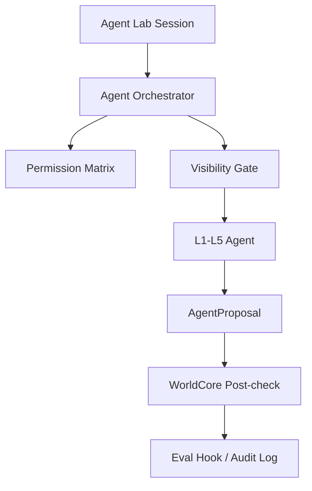

# v2.1.0-a1 Claude Code 架构尽调

状态：draft；等待 D-210 批准后执行。
日期：2026-05-22

## 结论先行

Claude Code 值得 RebornG 参考，但不适合直接复制或改造成游戏 runtime。

可吸收的是架构模式：

- agent loop。
- tool permission / approval。
- hooks。
- sessions。
- MCP。
- subagents 的隔离与职责描述。
- plugin / skill 的知识注入和路由。

不可吸收的是源码依赖：

- 不复制反编译、泄露、未授权源码。
- 不改造非开源 CLI 本体。
- 不把官方仓库作为可自由二次开发源码。
- 不把 Claude Code 的代码执行 agent 直接套成 RebornG NPC agent。

## 官方来源

| 来源 | 用途 | RebornG 吸收方式 |
|---|---|---|
| `https://github.com/anthropics/claude-code` | 官方仓库与许可边界 | 只引用公开入口和许可事实，不复制源码 |
| `https://code.claude.com/docs/en/agent-sdk/overview` | Agent SDK 总览 | 参考 agent loop、tool、session、context 思路 |
| `https://code.claude.com/docs/en/agent-sdk/agent-loop` | agent loop | 转译为 Agent Orchestrator 循环 |
| `https://docs.anthropic.com/en/docs/claude-code/sub-agents` | subagents | 参考职责隔离和上下文隔离，不启用 RebornG 可写子代理 |

## 可吸收模式

| Claude Code 模式 | RebornG 转译 | 边界 |
|---|---|---|
| agent loop | Agent Orchestrator 循环 | 只调度 proposal，不裁决事实 |
| tools | WorldCore-approved tools | 工具不能写 canon/save/runtime |
| permissions / approval | 权限矩阵 | save/canon/DeepSeek/RAG/BFF 全部默认禁止 |
| hooks | eval / audit hook | 用于记录、检查、阻断，不做自动修复 |
| sessions | 场景会话 | session memory 不等于持久事实 |
| MCP | 外部工具接口 | v2.1 不接外部 runtime 工具 |
| subagents | 职责隔离 | 不启用可写子代理；未来只评估只读/分析型 |
| skills/plugins | 专家团与知识路由 | 不把技能内容直接喂给 DeepSeek visible context |

## 与 RebornG Agent Lab 的关系

Claude Code 的工程哲学可以帮助 RebornG 解决三件事：

1. 工具权限：agent 想做什么，必须声明能力。
2. 上下文隔离：不同角色看到不同事实，不共享 hidden/private body。
3. 审计回放：每次调用、失败、重试、成本和输出都可追踪。

但 RebornG 多了两个游戏特有要求：

- WorldCore 是世界法律，不是 agent loop 的一个普通工具。
- 原著/hidden/private/canon 边界必须比普通代码 agent 更严格。

## 风险

| 风险 | 说明 | 处理 |
|---|---|---|
| 法务/许可风险 | 官方仓库不是可自由复制的开源实现 | 只吸收官方文档公开模式 |
| 错把 coding agent 当 NPC agent | Claude Code 擅长代码任务，不等于 NPC 社会模拟 | 只参考权限/工具/审计，不照搬角色逻辑 |
| subagent 误用 | 子代理提速可能破坏当前单线程审计和 git 边界 | v2.1 不启用；未来只做只读评估 |
| 工具越权 | 工具执行模型容易比叙事 agent 更危险 | 所有 tool proposal 进 WorldCore post-check |
| 上下文泄露 | hidden/private 被 agent 看到后很难保证不回显 | visibility gate 必须在上下文组装前执行 |

## 初步 RebornG 架构映射

## a1 结论

Claude Code 不是 RebornG agent 系统的源码基础，而是权限、会话、工具和审计模式的参考对象。

进入 a2 时，必须把这些模式落成：

- `AgentProposal`。
- permission matrix。
- visibility matrix。
- eval / audit hooks。
- WorldCore post-check。
