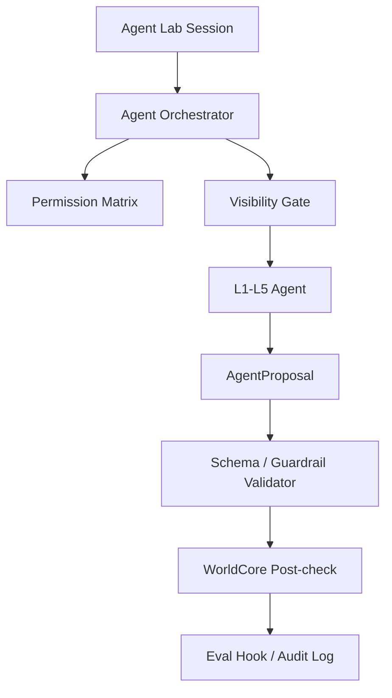

# v2.1.0-a1 Claude Code 与开源 Agent 框架架构尽调

状态：completed；已作为 v2.1.0-a2 Agent Lab 设计门禁输入。
日期：2026-05-22

## 入场记录

2026-05-22，用户明确要求进入 `v2.1.0-a1`。本阶段从 `codex/v210-a0-agent-lab-startup` 切到 `codex/v210-a1-agent-framework-diligence`，只执行 Claude Code 与开源 Agent 框架架构尽调、吸收矩阵校准和 a2 输入整理。

本阶段不授权：

- 依赖安装。
- runner / PoC。
- BFF/backend。
- live DeepSeek。
- 子代理。
- MiroFish export。
- runtime agent。
- save fields 或 `SAVE_FORMAT_VERSION` bump。
- DeepSeek prompt/context/model/authority 变化。

## 收束记录

2026-05-22，用户要求进入 `v2.1.0-a2`。a1 结论正式收束为 a2 输入：Claude Code 与开源 Agent 框架只提供权限、会话、工具、workflow、schema、memory、eval 和 sandbox 的架构模式；不形成选型，不安装依赖，不写 runner，不做 PoC，不调用 live DeepSeek，不启用子代理，也不接入 runtime。

## 结论先行

Claude Code 值得 RebornG 参考，但不适合直接复制或改造成游戏 runtime。GitHub 公开仓库不等于开源许可，Claude Code 官方 `LICENSE.md` 仍是 all-rights-reserved / commercial terms 口径，因此当前只能吸收公开架构模式。

同时，v2.1-a1 不应该只看 Claude Code。Agent Lab 后续会涉及 orchestration、permission、visibility、schema、eval、memory、workflow、sandbox 和 thin BFF 预备，必须把开源框架也纳入矩阵。

本阶段配套文件：

- `v2.1.0-a1-Agent框架吸收矩阵.md`

可吸收的是架构模式：

- agent loop。
- tool permission / approval。
- hooks。
- sessions。
- MCP。
- subagents 的隔离与职责描述。
- plugin / skill 的知识注入和路由。
- LangGraph / Mastra / ADK 类 workflow state machine。
- OpenAI Agents SDK / PydanticAI 类 guardrails、schema、tracing、validator。
- AutoGen / CrewAI 类多 agent 协作与流程分离。
- Letta 类长期记忆模型的风险样本。
- OpenHands 类 agent server / CLI / sandbox / RBAC 产品形态。

不可吸收的是源码依赖：

- 不复制反编译、泄露、未授权源码。
- 不改造非开源 CLI 本体。
- 不把官方仓库作为可自由二次开发源码。
- 不把 Claude Code 的代码执行 agent 直接套成 RebornG NPC agent。
- 不在 v2.1 引入 LangGraph、Mastra、ADK、OpenAI Agents SDK、AutoGen、CrewAI、PydanticAI、Letta 或 OpenHands 运行时依赖。
- 不让任何外部框架接管 WorldCore、save、canon、DeepSeek visible context、hidden/private facts 或 NPC 生死。

## 官方来源

| 来源 | 用途 | RebornG 吸收方式 |
|---|---|---|
| `https://github.com/anthropics/claude-code` | 官方仓库与许可边界 | 只引用公开入口和许可事实，不复制源码 |
| `https://raw.githubusercontent.com/anthropics/claude-code/main/LICENSE.md` | 官方许可文本 | 确认公开仓库不等于开源可复制 |
| `https://code.claude.com/docs/en/agent-sdk/overview` | Agent SDK 总览 | 参考 agent loop、tool、session、context 思路 |
| `https://code.claude.com/docs/en/agent-sdk/agent-loop` | agent loop | 转译为 Agent Orchestrator 循环 |
| `https://docs.anthropic.com/en/docs/claude-code/sub-agents` | subagents | 参考职责隔离和上下文隔离，不启用 RebornG 可写子代理 |

## 开源框架来源

| 来源 | 许可/状态 | RebornG 当前用途 |
|---|---|---|
| `https://github.com/langchain-ai/langgraph` | MIT | P0；长运行状态图、durable execution、human-in-loop |
| `https://github.com/mastra-ai/mastra` | 核心 Apache-2.0；企业目录另算 | P0；TS-first workflow/agent/memory/evals/MCP |
| `https://github.com/openai/openai-agents-python` / `https://github.com/openai/openai-agents-js` | MIT | P1；handoffs、guardrails、tracing、tools、sandbox-agent 概念 |
| `https://github.com/google/adk-python` | Apache-2.0 | P1；workflow runtime、Task API、human-in-loop、nested workflows |
| `https://github.com/microsoft/autogen` | code MIT；docs CC-BY-4.0 | P1；message passing、event-driven local/distributed runtime |
| `https://github.com/crewAIInc/crewAI` | MIT | P2；Crews/Flows 角色协作与流程分离 |
| `https://github.com/pydantic/pydantic-ai` | MIT | P1；schema、dependency injection、type-safe output、eval |
| `https://github.com/letta-ai/letta` | Apache-2.0 | P2；长期记忆与记忆污染测试 |
| `https://github.com/OpenHands/OpenHands` | 核心 MIT；enterprise 目录另算 | P2；agent server、CLI/GUI、权限/RBAC、sandbox 产品形态 |

## 可吸收模式

| 模式 | RebornG 转译 | 边界 |
|---|---|---|
| agent loop / workflow graph | Agent Orchestrator 循环 | 只调度 proposal，不裁决事实 |
| tools | WorldCore-approved tools | 工具不能写 canon/save/runtime |
| permissions / approval | 权限矩阵 | save/canon/DeepSeek/RAG/BFF 全部默认禁止 |
| hooks / guardrails | eval / audit hook | 用于记录、检查、阻断，不做自动修复 |
| sessions / state | 场景会话 | session memory 不等于持久事实 |
| MCP / tool registry | 外部工具接口 | v2.1 不接外部 runtime 工具 |
| subagents / crews | 职责隔离 | 不启用可写子代理；未来只评估只读/分析型 |
| schema / typed output | `AgentProposal` validator | schema 只证明格式，不证明世界事实 |
| long-term memory | memory lab 风险样本 | 不允许记忆自进化污染 canon |
| sandbox / agent server | future thin BFF 参考 | v2.1 不建后端，不开放文件写入 agent |

## 与 RebornG Agent Lab 的关系

Claude Code 和开源 agent 框架可以帮助 RebornG 解决五件事：

1. 工具权限：agent 想做什么，必须声明能力。
2. 上下文隔离：不同角色看到不同事实，不共享 hidden/private body。
3. 审计回放：每次调用、失败、重试、成本和输出都可追踪。
4. 工作流：proposal 生成、WorldCore post-check、eval hook、replay archive 之间必须可暂停和可复现。
5. schema/eval：agent 输出必须先成为结构化 `AgentProposal`，再经过 validator 和 WorldCore。

但 RebornG 多了两个游戏特有要求：

- WorldCore 是世界法律，不是 agent loop 的一个普通工具。
- 原著/hidden/private/canon 边界必须比普通代码 agent 更严格。

## 风险

| 风险 | 说明 | 处理 |
|---|---|---|
| 法务/许可风险 | 官方仓库不是可自由复制的开源实现；部分项目含企业目录或文档另许可 | 只吸收官方文档公开模式；PoC 前单独 license review |
| 错把 coding agent 当 NPC agent | Claude Code / OpenHands 擅长代码任务，不等于 NPC 社会模拟 | 只参考权限/工具/审计，不照搬角色逻辑 |
| subagent 误用 | 子代理提速可能破坏当前单线程审计和 git 边界 | v2.1 不启用；未来只做只读评估 |
| 工具越权 | 工具执行模型容易比叙事 agent 更危险 | 所有 tool proposal 进 WorldCore post-check |
| 上下文泄露 | hidden/private 被 agent 看到后很难保证不回显 | visibility gate 必须在上下文组装前执行 |
| 依赖膨胀 | 同时引入多个 agent 框架会让系统难以审计 | v2.1 只做矩阵，不引入依赖 |
| 记忆污染 | 长期记忆可能把候选/谣言/幻觉写成事实 | memory 只能 report-only，不能写 canon/save |
| Python/TS 断层 | 多数成熟框架偏 Python，RebornG runtime 是 TS | b1 如做 runner，默认先评估 TS-first / pure helper |

## 初步 RebornG 架构映射

## a1 结论

Claude Code 不是 RebornG agent 系统的源码基础，而是权限、会话、工具和审计模式的参考对象。开源 agent 框架可以作为未来 Agent Lab 的设计语料和可能的隔离 PoC 候选，但 v2.1-a1 不做选型、不加依赖、不实现 runner。

进入 a2 时，必须把这些模式落成：

- `AgentProposal`。
- permission matrix。
- visibility matrix。
- eval / audit hooks。
- WorldCore post-check。
- external framework absorption matrix 的 go/no-go 决策项。

## 进入 a2 条件

a1 已完成，进入 a2 前确认：

- Claude Code 只作为官方公开架构模式参考，不复制源码。
- 开源框架只进入吸收矩阵和 a2 设计输入，不形成选型。
- LangGraph、Mastra、OpenAI Agents SDK、Google ADK、AutoGen、CrewAI、PydanticAI、Letta、OpenHands 均不得在 a1 被安装、调用或接入 runtime。
- D-211 已记录：b1/report-only offline runner 已受限批准；framework PoC、只读子代理、live DeepSeek、薄 BFF 仍未进入 b1。
