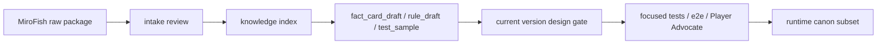

# 全书知识库治理制度

日期：2026-05-20
状态：项目级制度；v1.1-process-2 建立第一版
用途：把全书 MiroFish 包、原著事实、隐藏事实、source pointer、测试样本和 runtime canon 分层管理，避免“知识库”变成 DeepSeek 大上下文或未经审查的 canon。

## 核心原则

1. 知识库不是 runtime authority。
2. 知识库不是 DeepSeek visible context。
3. MiroFish 输出不是 canon，必须经过 intake review。
4. 任何吸收都必须转写为 RebornG-owned 摘要、规则、事实卡草案或测试样本。
5. hidden/private canon 不得进入玩家可见 UI、公开文案或 DeepSeek visible context。
6. 只有经过当前版本吸收、测试、用户决策和边界审查的极少数条目，才能进入 `src/canon/*.json`。

## 三层结构

| 层级 | 目录 | 权威状态 | 用途 |
|---|---|---|---|
| 原始交付档案层 | `指导大纲/vMiroFish/` | 候选材料；非 canon | 保存 quote-redacted 包、report、ledger、intake review |
| RebornG 知识索引层 | `指导大纲/知识库/蛊真人/` | 项目索引；非 runtime | 存摘要、source pointer、可见性、晋升状态、测试引用 |
| runtime canon 层 | `src/canon/*.json` | 运行时真相源 | 只存已吸收、已测试、已批准的安全子集 |

当前全书基础包档案入口：

- `指导大纲/vMiroFish/基础包/`
- `指导大纲/vMiroFish/intake-reviews/v1.1.0/2026-05-20-全书基础包入库使用计划.md`

基础包只登记为档案层和 source pointer 后勤仓库。不得整包导入知识索引、runtime、DeepSeek 或玩家可见 UI；每次使用必须按主题切片完成 intake review。

## 知识条目最小字段

知识索引条目必须具备：

```json
{
  "id": "kb_xxx",
  "kind": "person | faction | place | event | gu | material | timeline | hidden_fact | if_boundary | rule_sample",
  "summary": "项目自有摘要，不复制原文",
  "sourcePointers": ["..."],
  "visibility": "public | player_visible | hidden_ref_only | private | deferred",
  "promotionStatus": "raw_candidate | intake_accepted | fact_card_draft | rule_draft | test_sample | runtime_promoted | deferred | quarantined | rejected",
  "allowedUses": ["design_review", "test_matrix", "fact_card_draft"],
  "forbiddenUses": ["deepseek_visible_context", "player_visible_hidden_body", "runtime_authority"],
  "mirofishRefs": ["..."],
  "testSampleRefs": ["..."],
  "lastReviewedVersion": "v1.1.0",
  "reviewNotes": "..."
}
```

Markdown 索引也必须包含同等信息，不允许只写自然语言清单。

## 晋升链



任一环节失败时，只能进入 `deferred`、`quarantined` 或 `rejected`，不能绕过流程。

## 可用与禁用

允许：

- Codex / 专家团阶段启动时查知识索引，生成候选需求、边界问题和测试样本。
- Lore guard 审查原著边界、术语和 hidden/private canon。
- QA 从知识索引抽样进入测试矩阵和漂移检查。
- MiroFish intake 后把候选材料重写为项目摘要。

禁止：

- DeepSeek 直接读取全书知识库。
- UI 直接展示 hidden/private 条目。
- 把 MiroFish `runtimeAuthority`、`deepSeekAuthority` 或 hidden body 当作真相。
- 为了快速开发跳过 source pointer、可见性、晋升状态和测试引用。
- 把知识库条目直接复制进 `src/canon`。

## 责任分工

| 角色 | 责任 |
|---|---|
| Project Lead | 决定知识库建设节奏和版本落点 |
| Canon/Knowledge Curator | 维护三层晋升链、条目状态、废弃/隔离记录 |
| Lore & World Designer | 审查术语、原著边界、hidden/private canon |
| QA/Test Engineering Guardian | 把知识库风险转成测试矩阵和漂移样本 |
| AI Pipeline Architect | 确认 DeepSeek visible context 只拿安全摘要 |
| Codex Safety Officer | 防止知识库、MiroFish 包、runtime canon 混层 |

## 建库节奏

- v1.1-process-2：创建知识库入口、字段规范、使用规则和首批目录。
- v1.1-a2：把 v1.1 三包 intake 的可用项登记为索引草案或样本引用。
- v1.2-v1.5：按经济、NPC、区域、冲突逐步增长索引，不追求全书一次性 runtime 化。
- v1.6：正式建设内容生产、canon schema、长测工厂和知识库检查脚本。
- v2.0 前：选定第一个区域活世界所需知识子集，做完整晋升审查。

## 工程化检查

v1.1-process-2 先建立检查口径。v1.1-b1 或 process-1 起逐步补脚本：

- `check:knowledge-index-boundaries`：验证知识条目有 id、kind、sourcePointers、visibility、promotionStatus、allowedUses、forbiddenUses。
- `check:mirofish-intake-promotions`：v1.6 后验证 intake review 到知识索引/测试矩阵的引用链。

脚本未完成前，阶段文档必须人工列出本阶段使用了哪些知识条目、如何使用、是否进入 runtime、是否有 hidden/private 风险。

## 废弃与减法规则

知识条目、制度或文档只有满足以下条件，才可以标记为历史或废弃：

1. 有新的当前入口替代它。
2. 当前入口明确引用旧文件为历史来源或迁移来源。
3. 没有 runtime、测试、交接或阶段门禁仍依赖旧文件。
4. 废弃记录写明原因、替代文件、影响范围。
5. 不删除历史证据，除非用户单独批准清理。

默认减法方式是“收入口、标历史、加替代指针”，不是删除。
