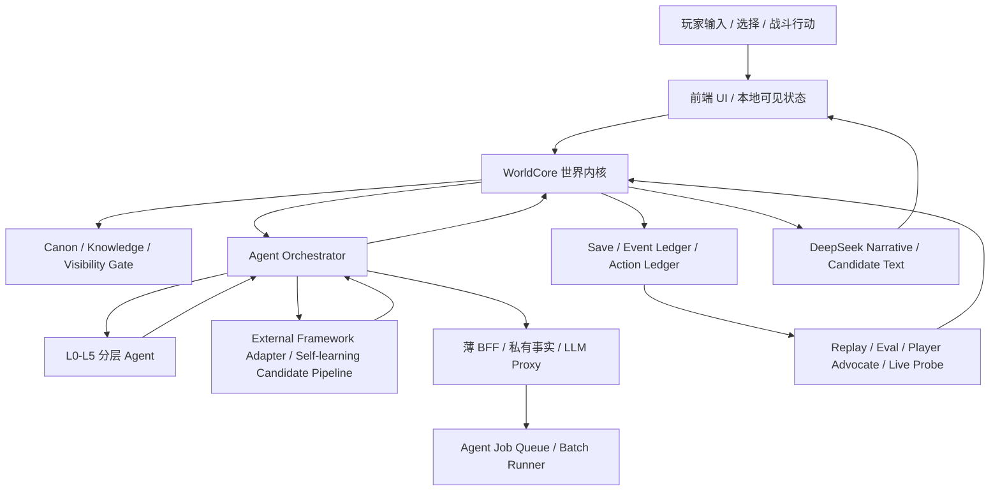

# v2.0-v4.0 世界内核与 Agent 协作架构草案

日期：2026-05-22
状态：长期架构草案；不授权实现。

## 总架构



核心原则：

- `WorldCore` 是裁决者。
- agent 是观察者、建议者、表达者。
- BFF 是基础设施，不是世界裁判。
- DeepSeek 是叙事和候选生成器，不是事实引擎。
- 外部框架和 self-learning 只能通过 adapter 输出 proposal/report，不能绕过 Agent Orchestrator 或 WorldCore。

## WorldCore 职责

WorldCore 负责：

- 玩家行动裁决。
- 位置、路线、区域、身份、经济、战斗、NPC 生死、奖励和正史锚点。
- 宿命/天道压力的最终结算。
- hidden/private visibility gate。
- action ledger / event ledger 写入。
- save migration 和 replay 可复现性。

WorldCore 不负责：

- 写文学化叙事。
- 让所有 NPC live 思考。
- 直接读取原著全文。
- 自己绕过 MiroFish intake 或知识库治理。

## Agent Orchestrator 职责

Agent Orchestrator 负责：

- 选择哪些 agent 被唤醒。
- 组装 agent 可见上下文。
- 限制 token、频率、可见事实和输出 schema。
- 收集 `AgentProposal`。
- 把 proposal 交给 WorldCore 审核。
- 记录 agent 输出、成本、失败、重试和 eval refs。

它不能：

- 直接写 store。
- 直接改 canon。
- 直接批准正式地点、阵营、奖励、NPC 生死。
- 直接向 DeepSeek 暴露 hidden/private body。

## External Framework Adapter 职责

外部框架包括但不限于 Hermes、LangGraph、Mastra、Dify、Flowise、AutoGPT、Agno、Browser-use、LlamaIndex、Letta、OpenHands、AutoGen。

adapter 负责：

- 把外部框架思想转成 RebornG-owned schema。
- 将外部输出限制为 `AgentProposal`、report、coverage、eval suggestion 或 candidate patch。
- 做 license/SBOM/架构适配记录。
- 记录输入、输出、模型、依赖、成本、日志、归档路径。
- 把 self-learning 结果降级为 `candidate_memory_patch`、`candidate_skill_patch` 或 future_sample_pool 建议。

adapter 不能：

- 直接安装依赖或启用 PoC。
- 直接读取/写入 RebornG 项目文件。
- 执行 shell、package、project 命令。
- 生成可直接应用的 patch artifact。
- 操作 git。
- 写 canon、runtime、save、prompt、知识库正文或 DeepSeek visible context。
- 绕过 WorldCore/post-check/eval farm/用户门禁。

当前状态：

- `Agent-Framework-Landscape-2026吸收矩阵.md` 是 adapter 评估的当前覆盖层。
- Hermes 是 P0 架构参考/P1 隔离 PoC 候选；当前只批准 license/SBOM/架构适配评估，不批准 PoC。
- 任何外部框架进入 runtime 前，必须先通过 RebornG-owned adapter 和 `AgentProposal` schema。

## AgentProposal 草案

长期可考虑的 proposal envelope：

```ts
type AgentProposal = {
  proposalId: string
  agentId: string
  agentLayer: "L0" | "L1" | "L2" | "L3" | "L4" | "L5"
  sourceEventRefs: string[]
  visibleFactRefs: string[]
  hiddenFactRefs?: string[]
  proposalKind:
    | "memory_reflection"
    | "npc_intent"
    | "faction_pressure"
    | "region_event_candidate"
    | "combat_tactic_candidate"
    | "heaven_will_pressure"
    | "narrative_expression"
  publicSummary: string
  privateSummaryRef?: string
  candidateEffects: unknown[]
  forbiddenEffects: string[]
  confidence: "low" | "medium" | "high"
  requiresWorldCoreAdjudication: true
}
```

注意：这是长期草案，不是当前实现字段表。

## Agent 分层协作

### L0：规则实体层

对象：

- 地点。
- 物品。
- 蛊虫。
- 资源。
- 天气。
- 事件账本。

技术：

- 规则、状态机、概率表、冷却、资源消耗。

用途：

- 提供世界的物理和系统反应。
- 不调用 LLM。

### L1：低成本环境行为层

对象：

- 路人。
- 商贩。
- 巡逻。
- 兽群。
- 普通环境压力。

技术：

- 行为树。
- 效用 AI。
- 事件模板。
- 阈值/权重。

用途：

- 让世界对玩家行为有日常反应。
- 保持可测、低成本、高覆盖。

### L2：批处理人格与小势力层

对象：

- 次要 NPC。
- 小队成员。
- 地方小势力。
- 商队小头目。

技术：

- 结构化记忆。
- 批处理反思。
- 目标队列。
- 偶发 LLM 总结。

用途：

- 每次关键事件后更新态度、利益、记忆、下一步候选。
- 默认离线或后台 job，不阻塞玩家操作。

### L3：当前场景关键 NPC

对象：

- 玩家当前正在对话、交易、冲突、合作的关键 NPC。

技术：

- live DeepSeek。
- 强 schema。
- visible context only。
- WorldCore post-check。

用途：

- 负责语言、语气、临场意图候选。
- 不能结算事实。

### L4：原著关键人物和大势力核心

对象：

- 方源、白凝冰等重要角色。
- 大势力核心人物。
- 与正史锚点强相关人物。

技术：

- source pointer。
- 私有事实服务。
- 强审计。
- 人工/用户门禁。

用途：

- 原著人物不能像普通 NPC 一样自由模拟。
- L4 进入 runtime 前必须有 blocking intake、测试矩阵和用户审批。

### L5：天道、宿命、时代大势

对象：

- 天道。
- 宿命。
- 宿命蛊状态。
- 尊者布局。
- 区域灾劫、兽潮、市场/战争大势。

技术：

- 宏观导演。
- 压力场。
- 因果债。
- fate anchor graph。
- era state。

用途：

- 决定哪些事更容易发生、哪些事被排斥、哪些 IF 代价上升。
- 不是一个可聊天 NPC。
- 不直接宣判玩家结局。

## 薄 BFF / 后端职责

未来薄 BFF 优先做：

- DeepSeek API proxy，保护 key。
- private canon / hidden body 按可见性下发。
- agent job queue。
- prompt hash、token、cache、cost、retry、failure 记录。
- replay/eval archive。
- 云存档和跨设备同步。

后端不能做：

- 自己批准奖励。
- 自己改 NPC 生死。
- 自己绕过 WorldCore 写存档。
- 自己把 hidden/private 总结喂给 DeepSeek。

## 数据流

标准链路：

1. 玩家行动进入 UI。
2. UI 只提交意图，不结算。
3. WorldCore 检查 canon、state、visibility、规则和前置。
4. Agent Orchestrator 只唤醒必要 agent。
5. agent 输出 proposal。
6. WorldCore 审核 proposal。
7. 合法结果写入 action/event ledger。
8. DeepSeek 根据已批准事实写叙事。
9. Eval/Player Advocate/长测检查漂移。

## 战斗表达扩展

低阶凡人阶段：

- 现有棋盘继续可用。
- 每回合叙事文本可作为战斗 log，但必须来自 `BattleResolutionStep`。

高阶/蛊仙阶段：

- 棋盘不应被废弃，而应降级为局部层。
- 增加 theater map：地面、空中、地下、水域、仙窍、阵法、领域。
- 增加 killer-move stack：杀招施展、反制、干扰、反噬、环境破坏。
- 增加 domain / formation / Immortal Gu House 状态。
- DeepSeek 只解释每步的可见后果，不计算伤害和胜负。

## 最小实验架构

v2.1-v2.3 Agent Simulation Lab 可先做离线：

- JSON 场景输入。
- 20 NPC。
- 3 势力。
- 1 L5 宏观导演。
- 100-300 轮 replay。
- 输出报告，不写正式存档。

通过后再评估：

- 是否接入 BFF。
- 是否让 L2 批处理结果进入 runtime candidate。
- 是否让 L3 关键 NPC live 参与当前场景。

## 结论

RebornG 的 agent 架构必须像一个国家机器：世界内核是法律，agent 是人、组织和天气，DeepSeek 是语言，后端是基础设施。任何一层越权，长期叙事都会崩。
